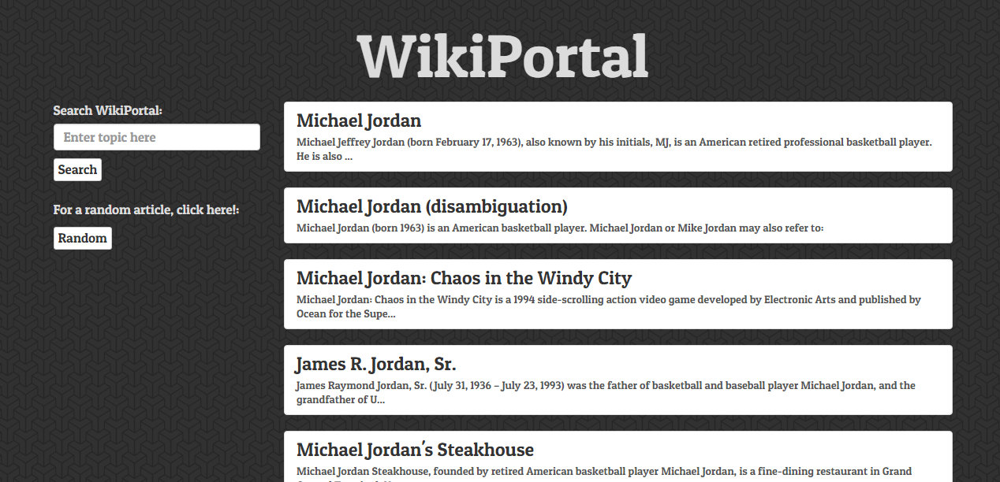
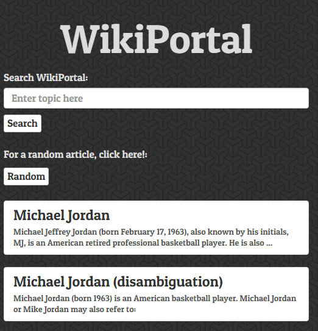

# Wikipedia Viewer

**About the Project**

Wikiportal is simple application that was created to learn about the type of information available via the Wikipedia API.  The application is built with AngularJS, HTML5 and CSS.

**Features**

* User can search for any topic via search input.
* User can click on a button for a random article.
* Bootstrap was used for the layout and styling.
* Integration with Wikipedia API.
* Used AngularJS and the ng-animate service for article transitions.

**What I learned**

On this project I was able to learn an API I had not used before, the Wikipedia API.  I also was able to use Angular's ng-animate service, which I used to transition the incoming and outgoing articles.

